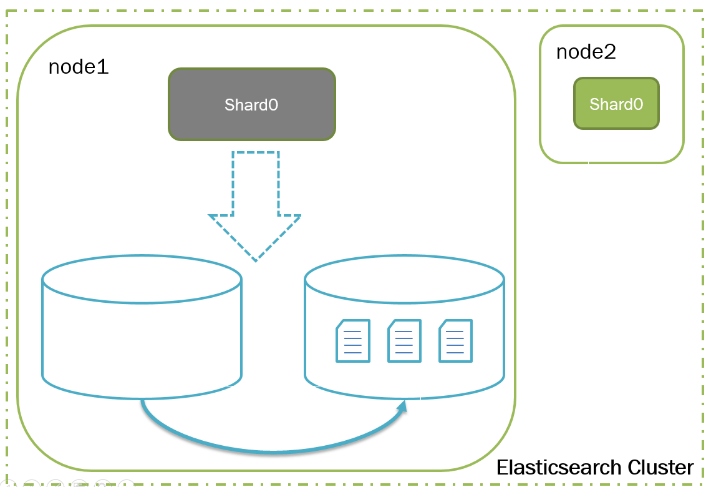
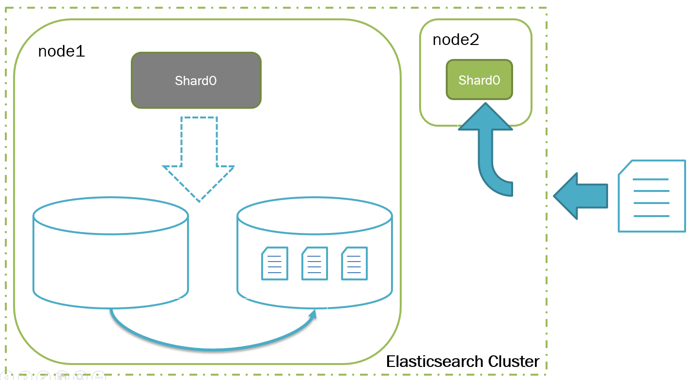
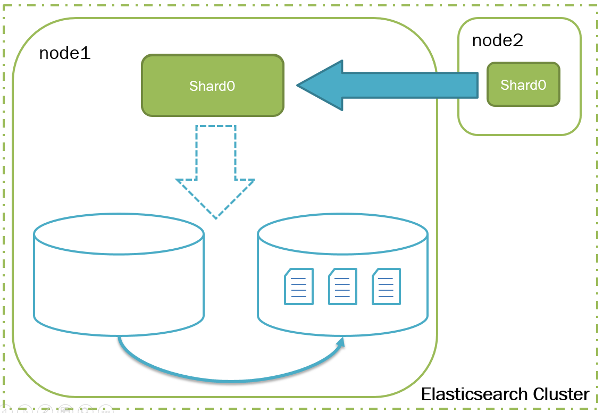

# Elasticsearch Prior Store Plugin

If you have multiple data pathes configured in one es node, and one of data path is SSD with smaller available space, and you just want data to be store in that data path under SSD. Unfortunately, es store data in the device which has more available space by default, so that you may not able to use that SSD.

So, this *Prior Store Plugin* is designed to solve the problem. Data will be store in the specified data path preferentially, and once the device's available space exceeds a threshold, data will be transferred to other devices in background automatically.

## Configurations

- `data.prior.path` REQUIRED. The data path which you want to store preferentially.
- `store.prior.enabled` OPTIONAL, *default true*.
- `store.prior.migration.threshold` OPTIONAL. *default 0.8*. The threshold to trigger data transfer
- `store.prior.max.threshold` OPTIONAL. *default 0.85*. Once exceeds this threshold, data will be stored to other pathes.
- `store.prior.migration.schedule.interval` OPTIONAL. *TimeValue default 1h*. How long schedule a data check and transfer.
- `store.prior.migration.concurrent`: OPTIONAL. default *5*. The max count of shards which can be closed and transferred simultaneously.

## How to transfer the data?

firstly, the corresponding shards' will be closed, so that Lucene will release the lock, and also we can transfer the data without being changed, and delete them after transferring.

You may ask what is going to happen if there're index requests coming to the corresponding index or even the shard?  
Don't forget we have replicas (once we close a shard, primary shard will be in the others). The other shards will be responsable for index and search requests during the time we close and transfer the shard data.  
**So all the indices are supposed to have at least 1 replica to make it available during transfering.**

After transfering the shard data, we reopen the shard, and elasticsearch will recover data from primary automatically.

